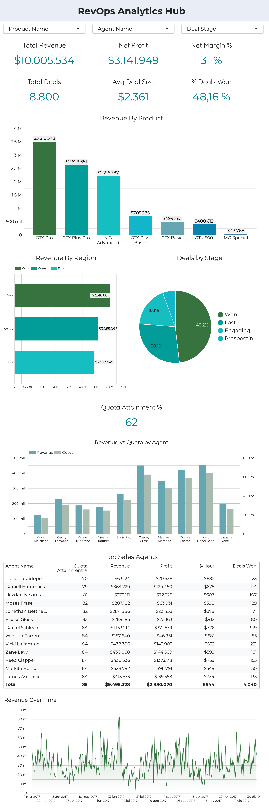
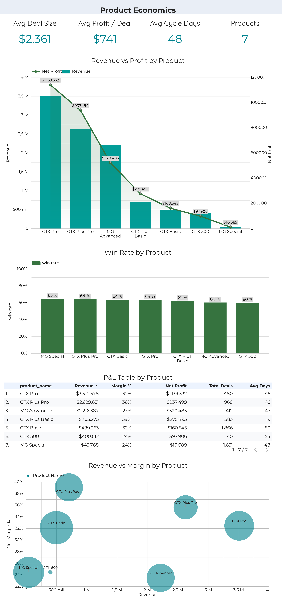
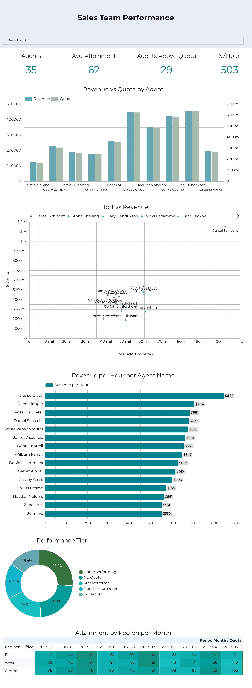

# RevOps Analytics Hub

**End-to-end ELT pipeline for Revenue Operations analytics** — from raw data ingestion through Google BigQuery, dbt transformations with dimensional modeling, to executive dashboards in Looker Studio.

**[Live Dashboard (Looker Studio)](https://lookerstudio.google.com/reporting/0f8355e4-0b4e-4cf0-8fd9-
cbdaf9dc5dcb)** — interactive, click to explore filters, drill-downs, and cross-filtering across all 3 pages.

This project replicates the same architecture a modern data team would build in production to answer critical business questions:

- Which sales reps are hitting quota? Who needs coaching?
- What is the true profitability per product after all costs?
- Which accounts are at risk of churning?
- How does sales activity effort correlate with closed revenue?

> **Note:** This project uses CSV datasets and Python scripts for ingestion. In a production environment, the data sources would be SaaS platforms (Salesforce, HubSpot, Stripe) and the ingestion layer would use managed connectors like Fivetran or Airbyte. The transformation and modeling layers (dbt + BigQuery) are identical to what runs in enterprise environments. See [Enterprise Equivalents](#enterprise-equivalents) for the full comparison.

---

## Architecture

```
┌──────────────────┐     ┌──────────────────┐     ┌──────────────────┐     ┌──────────────────┐
│   DATA SOURCES   │     │    INGESTION     │     │   TRANSFORM      │     │    CONSUME       │
│                  │     │    (Python)      │     │   (dbt Core)     │     │ (Looker Studio)  │
├──────────────────┤     ├──────────────────┤     ├──────────────────┤     ├──────────────────┤
│ Kaggle CRM data  │────>│ load_to_         │────>│ staging (views)  │────>│ Executive        │
│ Faker synthetic  │     │ bigquery.py      │     │ intermediate     │     │ dashboards       │
│ (9 CSV files)    │     │                  │     │ marts (tables)   │     │ (3 pages)        │
└──────────────────┘     └──────────────────┘     └──────────────────┘     └──────────────────┘
        │                        │                        │                        │
   9 source tables        BigQuery: raw            BigQuery: analytics       Star schema
   60,181 rows            (9 tables)               (17 models)              (3 dim + 2 fct)
```

### What each layer demonstrates

| Layer | What I built | Skill demonstrated |
|-------|-------------|-------------------|
| Ingestion | Python script with explicit schemas loading CSVs to BigQuery | **Data Engineering** — custom ELT pipeline |
| Transformation | 17 dbt models across 3 layers with Jinja templating | **Analytics Engineering** — dbt + SQL |
| Modeling | Star schema with 3 dimensions + 2 fact tables | **Dimensional modeling** — Kimball methodology |
| Data quality | 30 automated dbt tests catching real data issues | **Data governance** — testing & validation |
| Synthetic data | Python Faker generating 5 realistic enterprise tables | **Automation** — reproducible data generation |
| Dashboards | Looker Studio connected to BigQuery marts (3 pages) | **BI & storytelling** — actionable insights |

---

## Dashboard & Key Insights

The Looker Studio dashboard consists of three pages, each designed for a different stakeholder persona.

### Page 1 — Executive Overview



**KPIs at a glance:**

| Metric | Value |
|--------|-------|
| Total Revenue | $10,005,534 |
| Net Profit | $3,141,949 |
| Net Margin | 31% |
| Total Deals | 8,800 |
| Avg Deal Size | $2,361 |
| Win Rate | 48.16% |

**Key findings:**
- **GTX Pro dominates revenue** ($3.5M) but GTX Plus Pro shows the highest growth trajectory — a signal to reallocate quota targets and marketing spend.
- **West region leads revenue** at $3.1M, but Central is underperforming at $1.8M — worth investigating whether it's a headcount issue, territory quality, or manager effectiveness.
- **48% of deals are still in Prospecting stage** — the pipeline is top-heavy, indicating potential bottleneck in qualification. A VP of Sales would want to audit the Prospecting-to-Engaging conversion rate.
- **Quota attainment averages 62%** across the team — well below the 80% target most organizations set, suggesting quotas may need recalibration or reps need additional enablement.

### Page 2 — Product Economics



**Key findings:**
- **GTX Plus Pro has the highest margin (36%)** while generating $2.6M in revenue — the best revenue-to-margin ratio in the portfolio. Sales incentives should prioritize this product.
- **MG Special has the highest win rate (65%) but minimal revenue ($43K)** — it may serve as an effective land-and-expand entry product rather than a revenue driver.
- **Average sales cycle is 48 days** across all products. GTX Pro and GTX Plus Pro close in ~46 days while GTX 500 takes 54 — longer cycles with lower margin make GTX 500 a candidate for repricing or bundling.
- **The P&L table reveals that 3 of 7 products generate 82% of total profit** — a classic Pareto distribution that should inform product strategy and sunset decisions.

### Page 3 — Sales Team Performance



**Key findings:**
- **Eliseo Cruz generates $962/hour** — nearly 2x the team average ($503/hour). His approach should be documented as a playbook for the rest of the team.
- **Effort does not linearly correlate with revenue.** The scatter plot shows that Daniel Schoette logs the most activity minutes but is outperformed by agents with fewer but higher-quality touchpoints — a coaching opportunity for the sales manager.
- **29 of 35 agents have exceeded quota at least once**, but average attainment sits at 62% — this spread indicates high variability month-over-month, not consistent performance. A rolling 3-month attainment metric would surface this more clearly.
- **Performance Tier distribution:** the majority of agent-months fall into Underperforming (<80%), with a small slice of Star Performers (>=120%) — typical of organizations where quota-setting relies on top-down targets rather than bottoms-up capacity planning.
- **Regional heatmap** shows the East office consistently outperforms West and Central in quota attainment despite West leading in raw revenue — East has better quota calibration or more realistic territory assignments.

---

## Tech Stack

| Layer | Tool | Purpose |
|-------|------|---------|
| Data Sources | Kaggle + Python Faker | Raw CRM data + synthetic enterprise data |
| Ingestion | Python (pandas + google-cloud-bigquery) | Extract CSVs, load to BigQuery with explicit schemas |
| Data Warehouse | Google BigQuery | Serverless cloud warehouse — 2 datasets: `raw` + `analytics` |
| Transformation | dbt Core 1.11 | SQL-based transformations with testing and documentation |
| BI Layer | Looker Studio | Interactive dashboards connected to BigQuery marts |
| Version Control | Git + GitHub | Code, models, and documentation |

---

## Data Sources

### Raw data (Kaggle — CRM Sales Pipeline)

These 4 tables simulate what would come from a **CRM system like Salesforce or HubSpot** via a connector like Fivetran:

| Table | Rows | Simulates | Description |
|-------|------|-----------|-------------|
| `accounts` | 85 | CRM Accounts | Customer accounts with annual revenue, sector, and employee count |
| `products` | 7 | Product Catalog | Product lines (GTX, MG, Alpha series) with list prices |
| `sales_teams` | 35 | CRM Users | Sales agent hierarchy: Agent → Manager → Regional Office |
| `sales_pipeline` | 8,800 | CRM Opportunities | Sales deals with stages (Prospecting → Won/Lost), values, and dates |

### Synthetic data (Python Faker — Enterprise systems)

These 5 tables were generated with Python Faker to simulate data from **separate enterprise systems** that don't have pre-built connectors — exactly the scenario where a Data Engineer writes custom ingestion:

| Table | Rows | Simulates | Description |
|-------|------|-----------|-------------|
| `quotas` | 420 | CRM Quotas (Xactly/Salesforce) | Monthly sales targets per agent with seasonal adjustments |
| `activities` | 48,983 | CRM Activities | Calls, emails, meetings, demos linked to opportunities |
| `costs` | 7 | ERP (SAP/NetSuite) | Product cost structure: COGS, shipping, support, commission % |
| `nps_surveys` | 262 | Survey Tool (Qualtrics) | Quarterly NPS surveys per account with scores and comments |
| `support_tickets` | 1,582 | Support Platform (Zendesk) | Tickets with priority, category, resolution time, satisfaction |

**Total: 60,181 rows across 9 tables from 5 different source systems**

---

## dbt Transformation Layers

### Layer 1: Staging (`stg_`) — Clean & Standardize

**Materialized as: VIEWS** (no storage cost, recalculated on query)

One model per raw table. No business logic — only rename columns to consistent conventions, cast data types, and handle nulls. This is the single point of contact with raw data.

```
raw.accounts       →  stg_accounts       (account → account_name, revenue → annual_revenue_usd)
raw.products       →  stg_products       (product → product_name, sales_price → list_price_usd)
raw.sales_pipeline →  stg_sales_pipeline (close_value → close_value_usd, deal_stage standardized)
raw.quotas         →  stg_quotas         (includes deduplication window function — see Data Quality)
...9 models total
```

### Layer 2: Intermediate (`int_`) — Business Logic

**Materialized as: VIEWS** (reusable building blocks, never exposed to dashboards)

This is where tables are joined and business metrics are calculated:

| Model | Joins | Key metrics |
|-------|-------|-------------|
| `int_deal_economics` | pipeline + costs | `net_profit_usd` (revenue - COGS - shipping - support - commission), `days_in_pipeline`, `is_won` |
| `int_sales_performance` | deals + quotas + activities | `quota_attainment_pct`, `total_revenue_usd`, `total_activities`, `positive_outcomes` |
| `int_customer_health` | accounts + NPS + tickets + deals | `health_score` (0-100), `churn_risk` (High/Medium/Low), `avg_nps_score` |

**Health score formula:**
```
health_score = (avg_nps * 0.4) + (avg_satisfaction * 0.3) - high_priority_ticket_penalty + buyer_bonus
```
- 40% weight on NPS score
- 30% weight on CSAT (support satisfaction)
- Penalty for high-priority unresolved tickets
- +15 bonus for accounts with active purchases

**Churn risk classification:**
- **High**: NPS <= 3 AND >= 2 high-priority tickets
- **Medium**: NPS <= 5 OR CSAT < 3
- **Low**: Everything else

### Layer 3: Marts (`dim_` / `fct_`) — Star Schema

**Materialized as: TABLES** (pre-computed for fast dashboard queries)

Final analytical models consumed by Looker Studio. Designed using Kimball dimensional modeling:

#### Dimensions

| Model | Primary key | Business classifications |
|-------|------------|------------------------|
| `dim_accounts` | `account_name` | `account_tier` (Enterprise >= $500M / Mid-Market >= $100M / SMB), `health_score`, `churn_risk` |
| `dim_products` | `product_name` | `margin_tier` (High >= 40% / Medium >= 25% / Low), full cost structure |
| `dim_sales_teams` | `agent_name` | `manager_name`, `regional_office` |

#### Facts

| Model | Grain | Key measures |
|-------|-------|-------------|
| `fct_sales_pipeline` | One row per opportunity | `close_value_usd`, `net_profit_usd`, `days_in_pipeline`, `gross_margin_pct` |
| `fct_sales_performance` | One row per agent per month | `quota_attainment_pct`, `deals_won`, `total_revenue_usd`, `performance_tier` |

**Performance tier classification:**
- Star Performer: >= 120% quota attainment
- On Target: >= 100%
- Needs Improvement: >= 80%
- Underperforming: < 80%

---

## Data Quality

### 30 dbt tests across all layers

Every primary key is validated with `unique` + `not_null` tests. dbt runs these automatically after each transformation:

```bash
dbt test --profiles-dir .
# Finished running 30 tests — all passed
```

### Real issue caught: duplicate `quota_id`

During development, `dbt test` flagged duplicate `quota_id` values in the raw quotas table — the same agent had two quota entries for the same month.

**Resolution:** Added a `ROW_NUMBER()` window function in `stg_quotas` that deduplicates by keeping the highest quota amount per agent per month:

```sql
-- stg_quotas.sql (simplified)
with deduplicated as (
    select *,
        row_number() over (
            partition by quota_id
            order by quota desc
        ) as row_num
    from {{ source('raw', 'quotas') }}
)
select ... from deduplicated where row_num = 1
```

This follows the best practice of resolving data quality issues at the **earliest transformation layer** (staging), so downstream models always work with clean data.

---

## BigQuery Setup

### Datasets

| Dataset | Purpose | Contents |
|---------|---------|----------|
| `raw` | Landing zone for ingested data | 9 tables (loaded by Python script) |
| `analytics` | dbt-managed transformations | 12 views (staging + intermediate) + 5 tables (marts) |

### Authentication

```bash
# Development (what this project uses): personal OAuth
gcloud auth application-default login

# Production (what enterprises use): Service Account
# - JSON key stored in Secrets Manager
# - Attached to Airflow/Cloud Function/ECS task
# - Granular IAM roles (bigquery.dataEditor, bigquery.jobUser)
```

### Screenshots


---

## Enterprise Equivalents

Each component of this project maps directly to tools used in production data teams. The architecture and logic are the same — only the data source and the level of automation differ.

### This project vs. production

```
THIS PROJECT:
  Kaggle CSVs ──→ Python script ──→ BigQuery (raw) ──→ dbt ──→ BigQuery (marts) ──→ Looker Studio

ENTERPRISE:
  Salesforce  ──┐
  Stripe      ──┤──→ Fivetran ──→ Snowflake (raw) ──→ dbt Cloud ──→ Snowflake (marts) ──→ Looker / Tableau
  Google Ads  ──┤                      │
  Internal DB ──┘               Airflow (orchestration)
                          (Python custom for sources without connectors)
```

**The transformation logic is identical.** The only difference is that production uses managed connectors instead of CSV files, and an orchestrator to schedule runs automatically.

### Component-by-component comparison

#### 1. Data Sources

| This project | Production equivalent | When each is used |
|--------------|----------------------|-------------------|
| Kaggle CSV files | Salesforce, HubSpot, SAP, Zendesk, Stripe, Google Ads APIs | Real SaaS/ERP systems as live data sources |
| Python Faker synthetic data | Production databases, event streams, third-party APIs | When realistic test data is needed for development or staging environments |

#### 2. Ingestion

| This project | Production equivalent | When each is used |
|--------------|----------------------|-------------------|
| `load_to_bigquery.py` (custom Python) | **Fivetran** / **Airbyte** (managed connectors) | Standard SaaS sources with existing connectors (Salesforce, Stripe, Google Ads) |
| Same custom Python approach | **Custom Python scripts** | When no pre-built connector exists: internal APIs, FTP servers, legacy ERPs, proprietary databases |
| N/A | **Meltano** / **dlt** (open-source Python ingestion) | When teams want connector flexibility without Fivetran cost |

**Full connector landscape:**

| Tool | Type | Connectors | Cost | Best for |
|------|------|-----------|------|----------|
| **Fivetran** | Managed SaaS | 300+ | $$$$ | Enterprise teams that prioritize reliability over cost |
| **Airbyte** | Open source / Cloud | 350+ | Free (self-hosted) or $$ (cloud) | Teams that want connector breadth without vendor lock-in |
| **Stitch** | Managed SaaS | 130+ | $$ | Mid-market teams with standard SaaS sources |
| **Hevo Data** | Managed SaaS | 150+ | $$ | Teams needing no-code ingestion with built-in transformations |
| **Meltano** | Open source | 300+ (Singer taps) | Free | Engineering teams comfortable managing their own infrastructure |
| **dlt** | Python library | Any (code-first) | Free | Data engineers who prefer Python-native pipelines over YAML config |

> **Why the custom Python script matters:** Managed connectors cover ~80% of enterprise data sources. The remaining 20% — internal APIs, legacy systems, proprietary file formats — require custom ingestion code. This is the highest-value skill a Data Engineer brings to the table, and exactly what `load_to_bigquery.py` demonstrates.

#### 3. Data Warehouse

| This project | Production equivalent | When each is used |
|--------------|----------------------|-------------------|
| **Google BigQuery** | **Snowflake** | Most popular cloud-agnostic warehouse; dominant in companies not tied to a single cloud provider |
| | **Amazon Redshift** | AWS-native teams; common in organizations already deep in the AWS ecosystem |
| | **Databricks (Lakehouse)** | Teams needing both data engineering (Spark) and analytics in one platform; ML-heavy workloads |
| | **Azure Synapse** | Microsoft-shop enterprises already using Azure + Power BI |
| | **ClickHouse** | Real-time analytics on high-volume event data (adtech, product analytics) |
| | **DuckDB** | Local development, testing, and small-scale analytics without cloud costs |

**BigQuery-specific setup in this project:**

| Dataset | Purpose | Contents |
|---------|---------|----------|
| `raw` | Landing zone for ingested data | 9 tables (loaded by Python script) |
| `analytics` | dbt-managed transformations | 12 views (staging + intermediate) + 5 tables (marts) |

#### 4. Transformation

| This project | Production equivalent | When each is used |
|--------------|----------------------|-------------------|
| **dbt Core** (CLI, open source) | **dbt Cloud** | When teams want managed scheduling, CI/CD, IDE, docs hosting, and role-based access |
| | **SQLMesh** | Alternative to dbt with built-in column-level lineage, incremental by default, and virtual environments |
| | **Dataform** (Google) | Google-native alternative to dbt; tightly integrated with BigQuery but smaller ecosystem |
| | **Spark SQL** (Databricks) | When transformations require distributed processing for datasets too large for warehouse-native SQL |

#### 5. Orchestration

| This project | Production equivalent | When each is used |
|--------------|----------------------|-------------------|
| Manual execution (`dbt run`) | **Apache Airflow** | Industry standard; schedule DAGs, manage dependencies, alert on failures. Used by most data teams at scale |
| | **Dagster** | Modern alternative to Airflow with asset-based paradigm; better developer experience and testing story |
| | **Prefect** | Python-native orchestration with less boilerplate than Airflow; good for smaller teams |
| | **Google Cloud Composer** | Managed Airflow on GCP — same API, Google handles infrastructure |
| | **AWS MWAA** | Managed Airflow on AWS |
| | **dbt Cloud** (built-in scheduler) | When dbt is the only orchestration needed (no Python tasks, no multi-tool pipelines) |

#### 6. BI & Visualization

| This project | Production equivalent | When each is used |
|--------------|----------------------|-------------------|
| **Looker Studio** (Google, free) | **Looker** (Google, enterprise) | Full semantic layer with LookML, governed metrics, embedded analytics. Standard for data-mature orgs on GCP |
| | **Tableau** | Most powerful ad-hoc visual analytics; dominant in enterprises that prioritize self-service exploration |
| | **Power BI** | Microsoft ecosystem; best value for organizations already on Azure + Office 365 |
| | **Metabase** | Open-source, self-hosted BI with low learning curve; popular with startups and product teams |
| | **Sigma Computing** | Cloud-native BI with spreadsheet-like interface; targets business users who think in Excel |
| | **Hex** | Combines notebooks + dashboards; popular with data teams that need both analysis and reporting |

#### 7. Data Quality & Observability

| This project | Production equivalent | When each is used |
|--------------|----------------------|-------------------|
| **dbt tests** (30 tests, built-in) | **dbt tests + dbt expectations** | Sufficient for most teams; validate at transformation time with schema and custom SQL tests |
| | **Great Expectations** | When data quality checks need to run outside dbt — on raw files, API responses, or streaming data |
| | **Monte Carlo** | Automated anomaly detection across the entire data stack; alerts on freshness, volume, schema, distribution changes |
| | **Soda** | Open-source data quality with YAML-based checks; runs anywhere in the pipeline |
| | **Elementary** | dbt-native observability — extends dbt tests with anomaly detection, lineage, and Slack alerts |

#### 8. Version Control & CI/CD

| This project | Production equivalent | When each is used |
|--------------|----------------------|-------------------|
| **Git + GitHub** | **GitHub Actions** | Automate `dbt build` on pull requests; run tests before merging to production |
| | **GitLab CI** | Same concept, for teams on GitLab |
| | **dbt Cloud CI** | Slim CI — only builds and tests models affected by the PR, not the entire project |

#### 9. Authentication & Security

| This project | Production equivalent | When each is used |
|--------------|----------------------|-------------------|
| `gcloud auth login` (personal OAuth) | **Service Account + Workload Identity** | Production auth is machine-based: JSON key stored in Secrets Manager, attached to Airflow/Cloud Function tasks |
| | **IAM roles** (granular) | `bigquery.dataEditor` for load scripts, `bigquery.dataViewer` for dashboards, `bigquery.jobUser` for dbt |

#### 10. Data volume: when to scale beyond this approach

| Data size | Method | Tools |
|-----------|--------|-------|
| < 1 GB (this project) | `pd.read_csv` → load to BigQuery | pandas + BigQuery SDK |
| 1 - 10 GB | Python with chunked reads | `pd.read_csv(chunksize=50000)` |
| 10 - 100 GB | Upload to Cloud Storage first, then BigQuery LOAD | GCS + `bq load` |
| 100 GB - TB | Distributed processing | Spark (Databricks / Dataproc / EMR) |
| > TB | Streaming or incremental loads | Kafka → BigQuery, CDC pipelines (Debezium) |

#### Cloud platform comparison

| Layer | GCP (Google) | AWS (Amazon) | Azure (Microsoft) |
|-------|-------------|-------------|-------------------|
| Object Storage | Cloud Storage | S3 | Blob Storage |
| Data Warehouse | BigQuery | Redshift / Athena | Synapse Analytics |
| Ingestion/ETL | Dataflow | Glue | Data Factory |
| Streaming | Pub/Sub | Kinesis | Event Hubs |
| Orchestration | Cloud Composer (Airflow) | MWAA (Airflow) / Step Functions | Data Factory Pipelines |
| Serverless Compute | Cloud Functions | Lambda | Azure Functions |
| Secrets | Secret Manager | Secrets Manager | Key Vault |
| IAM | Cloud IAM | IAM | Entra ID (Azure AD) |

---

## Project Structure

```
revops-analytics-hub/
├── python/
│   ├── generate_synthetic_data.py    # Faker: generates 5 realistic enterprise tables (467 lines)
│   └── load_to_bigquery.py           # ELT: loads 9 CSVs to BigQuery with explicit schemas (186 lines)
├── data/
│   ├── raw/                          # Kaggle CRM dataset (4 CSVs, 8,927 rows)
│   │   ├── accounts.csv
│   │   ├── products.csv
│   │   ├── sales_teams.csv
│   │   └── sales_pipeline.csv
│   └── generated/                    # Faker synthetic data (5 CSVs, 51,254 rows)
│       ├── quotas.csv
│       ├── activities.csv
│       ├── costs.csv
│       ├── nps_surveys.csv
│       └── support_tickets.csv
├── revops_analytics/                 # dbt project
│   ├── dbt_project.yml               # Project config: name, profile, materialization rules
│   ├── profiles.yml                  # BigQuery connection: project, dataset, auth method
│   └── models/
│       ├── staging/                  # 9 stg_ models + src_raw.yml + stg_models.yml
│       ├── intermediate/            # 3 int_ models + int_models.yml
│       └── marts/                   # 5 dim_/fct_ models + marts_models.yml
├── docs/
│   └── screenshots/                  # Looker Studio dashboard captures
└── README.md
```

---

## How to Run

### Prerequisites
- Python 3.10+
- Google Cloud SDK (`gcloud`)
- A GCP project with BigQuery enabled

### Step-by-step

```bash
# 1. Clone and set up environment
git clone https://github.com/maorozco/revops-analytics-hub.git
cd revops-analytics-hub
python -m venv .venv
source .venv/bin/activate
pip install pandas faker numpy google-cloud-bigquery pyarrow db-dtypes dbt-bigquery

# 2. Authenticate with GCP
gcloud auth application-default login

# 3. Generate synthetic data (creates 5 CSVs in data/generated/)
cd python
python generate_synthetic_data.py

# 4. Load all 9 tables to BigQuery (raw dataset)
python load_to_bigquery.py

# 5. Run dbt transformations (creates 17 models in analytics dataset)
cd ../revops_analytics
dbt run --profiles-dir .

# 6. Run data quality tests (30 tests)
dbt test --profiles-dir .
```

---

## Key Design Decisions

1. **ELT over ETL** — Raw data is loaded as-is to BigQuery. All transformations happen in SQL via dbt, making them version-controlled, testable, and auditable. This is the modern standard (2015+) replacing legacy ETL tools like Informatica and SSIS.

2. **Star schema (Kimball)** — Marts use dimensional modeling (`dim_` / `fct_`) — the standard for analytical workloads and BI tools. Dimensions contain descriptive attributes; facts contain measurable events.

3. **Three transformation layers** — Staging (clean), Intermediate (logic), Marts (serve). Each layer has a clear responsibility, making the pipeline debuggable and maintainable.

4. **Views for staging/intermediate, Tables for marts** — Views cost $0 in storage and always reflect the latest data. Tables are pre-computed for the models that dashboards query hundreds of times per day.

5. **Explicit schemas on ingestion** — BigQuery load uses `SchemaField` definitions instead of auto-detect, ensuring type safety and catching schema drift early.

6. **Deduplication at the earliest layer** — Data quality issues (duplicate quota_ids) are resolved in staging so all downstream models work with clean data.

7. **Synthetic data with realistic patterns** — Generated tables follow real business logic: NPS scores correlate with deal activity, resolution times vary by ticket priority, quotas have seasonal adjustments (Q4 targets are 15% higher).

---

## Author

**Manuela Orozco** — Analytics Engineer

Built as a portfolio project demonstrating end-to-end data pipeline design, from raw ingestion to executive insights.

[LinkedIn](www.linkedin.com/in/manuela-orozco-ochoa-analyst-engineer) · [Email](mailto:maorozcooc@unal.edu.co)
